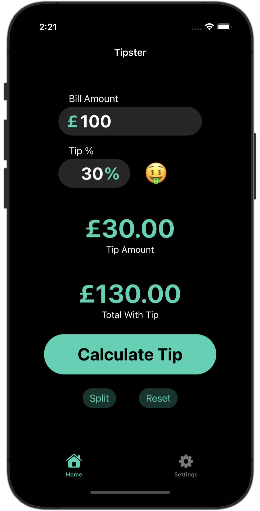

# Tipster

Simple and intuitive tip calculator app.

## Frameworks:
- SwiftUI
- MessageUI

## Features:
- Calculate tips.
- Divide the bill evenly amongst multiple people.
- Can send a message to every person with their bill portion.
- Can change currency symbol.
- Can change accent color of app to suit person preferences.
- Supports light and dark mode.

## Images:

  
  
  

